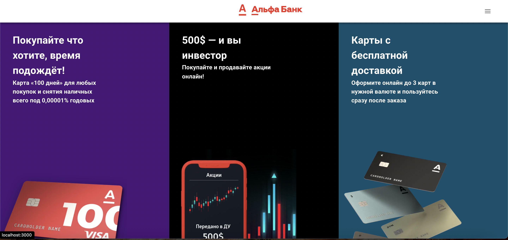
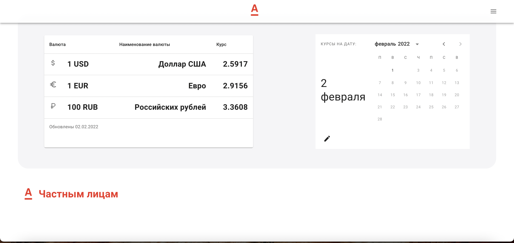
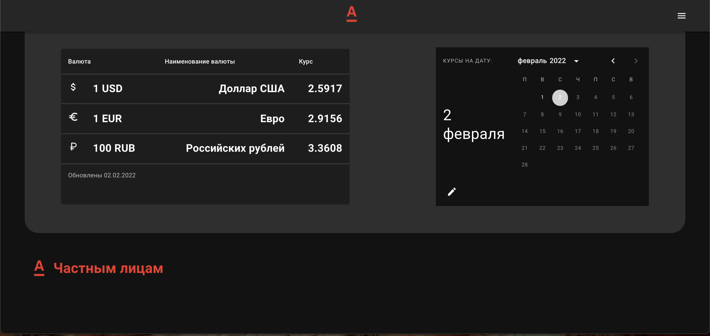
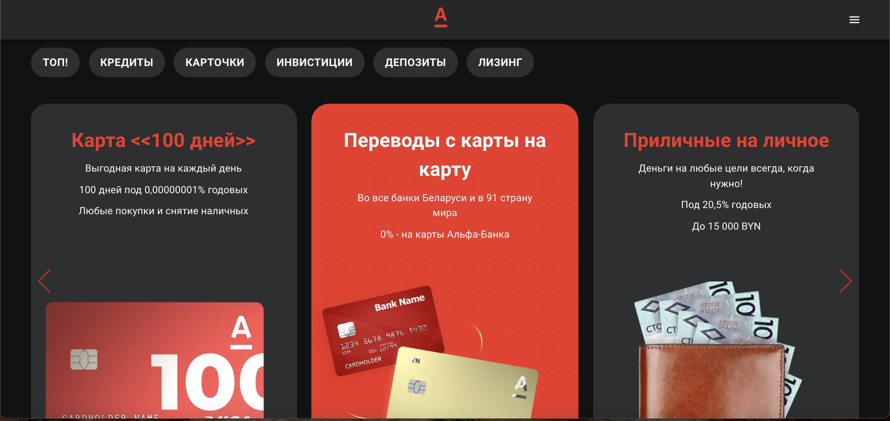

# Alfa App

## About Project:

[demo](https://alfa-react-application.firebaseapp.com/)

This project is a partial copy: https://www.alfabank.by 

When developing this Pet project, my goal was to practice working with code using TypeScript, as well as separating business logic and UI components using [Redux-Toolkit](https://redux-toolkit.js.org /) and [Redux-Thunk](https://github.com/reduxjs/redux-thunk )

To create UI components, I used the library [Material-UI](https://mui.com/)

Data on current exchange rates is provided by the open API of the National Bank of the Republic of Belarus.

I implemented the deployment of the project on the hosting [Firebase](https://firebase.google.com/)

### To develop the application, I used the following tools:

- [React.js](https://reactjs.org/)

- [Redux-Toolkit](https://redux-toolkit.js.org/)

- [React-router-dom](https://v5.reactrouter.com/)

- [Axios.js](https://axios-http.com/docs/intro)

- [Date-fns](https://date-fns.org/)

- [Swiper.js](https://swiperjs.com/)

- [React-scroll](https://www.npmjs.com/package/react-scroll)

- [Material-UI](https://mui.com/)










Quick start:

- Clone

```
  git clone https://github.com/Sergey-Shar/alfa_bank_copy.git
```

- Installing dependencies

```
  yarn install
```

- Start project

```
  yarn start
```

https://us05web.zoom.us/j/6696243572?pwd=NmR1TWgrMnZUOVB2SXRyb1lFdGtYZz09


